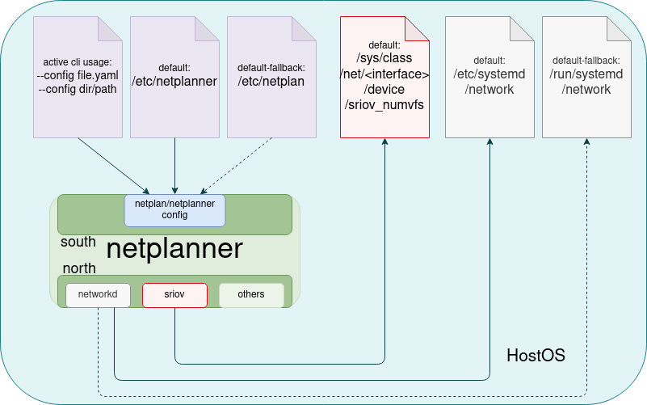

# netplanner

## Description

Netplanner implements the top-down datacenter approach for IP and Network Interface Management.
It plans the network on the host by using `systemd-networkd` as the underlying network configuration provider.

It refuses to implement L2 capabilities such as DHCP.

It also implements interfaces which are needed for L3 capabilities such as `Veth` and `Dummy` interface types.

It is open to be extended with other providers which have a different text-based input.

## Architecture



## Licenses

Running Code Licenses

* Python 3.x - today | [PSF LICENSE AGREEMENT FOR PYTHON](https://docs.python.org/3/license.html)
* dacite | [MIT License](https://github.com/konradhalas/dacite/blob/master/LICENSE)
* PyYaml | [MIT License](https://github.com/yaml/pyyaml/blob/master/LICENSE)
* fqdn   | [MPL-2 License](https://github.com/ypcrts/fqdn/blob/develop/LICENSE)
* Jinja2 | [BSD-3 License](https://github.com/pallets/jinja/blob/main/LICENSE.rst)

Building Tool for Dynamic Linked CLI Binary

* PyOxidizer | [MPL-2 License](https://github.com/indygreg/PyOxidizer/blob/main/LICENSE)

We relicensed this project to GPLv3 recently to cater for derivative work from [netplan](https://github.com/canonical/netplan) and to ease integration.

## How to use it

```console
# This is a developer command --local ensures that ./ is set on the output.
$ netplanner --local --config examples/worker-config-old.yaml --output /run/systemd/network --only-networkd configure

$ netplanner --help
usage: netplanner [-h] [--version] [--config CONFIG] [--debug] [--local] [--only-sriov] [--reload] [--only-networkd] [--output OUTPUT]
                  {configure,apply,generate} ...

options:
  -h, --help            show this help message and exit
  --version             show program's version number and exit
  --config CONFIG       Defines the path to the configuration file or directory.
  --debug               Enables debug logging.
  --local               This templates the configuration into a local directory
  --only-sriov          This only runs sriov configuration on supported interfaces.
  --reload              This reloads networkd and networkctl via systemd.
  --only-networkd       This templates only networkd configuration files.
  --output OUTPUT       The output directory to which the files will be written.

subcommands:
  valid subcommands

  {configure,apply,generate}
                        sub-command help
    configure           Configure Network Adapters flawlessly with the knowledge of the netplanner.
    apply               Configure Network Adapters flawlessly with the knowledge of the netplanner.
    generate            Configure Network Adapters flawlessly with the knowledge of the netplanner.
```

## Examples Directory

Inside the examples directory you can have a overview of different types of configurations.
